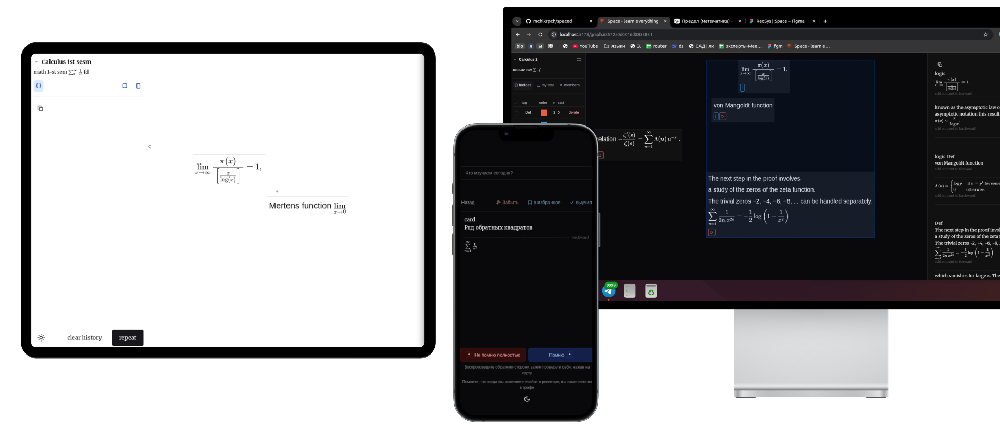

# Sp

```bashrc
cd Sp
npm install
npm run dev
```

- **Personalized learning channel (_TikTok-like_)** for courses at MIPT, MIT, HSE, MSU, and Harvard
- **Prediction of interval repetition** for reliable memorization,
- The shortest path from your knowledge to the skill you want to master (for example, "I want to remember the varieties", "I want to remember how problems with variable coefficients are solved").

